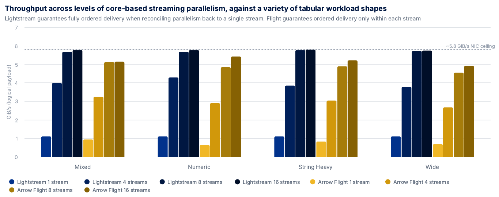
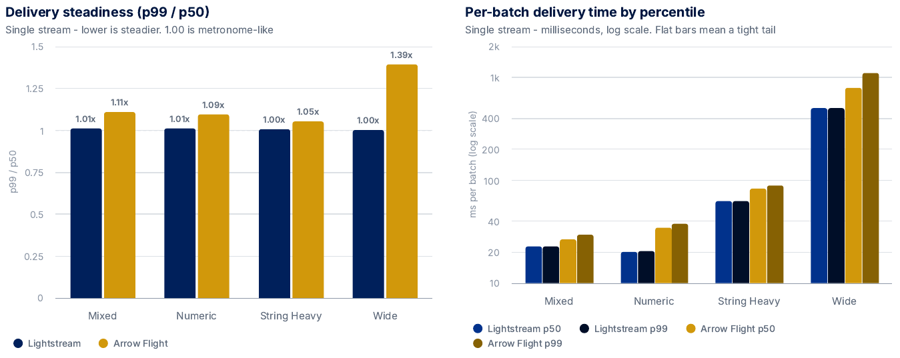
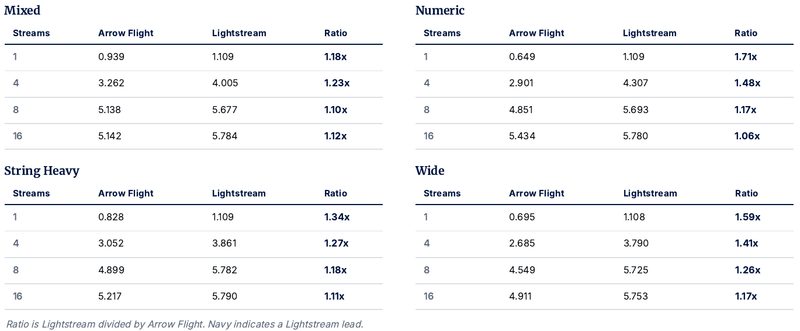

# Lightstream

**Send and receive typed Arrow and Protobuf data easily across networks and processes at speed.**

```python
for batch in ls.read("tcp://feed.example.com:9000"):
    process(batch)
```

Supported URI schemes include:

| Transport             | URI                     |
| --------------------- | ----------------------- |
| TCP                   | `tcp://host:port`       |
| Unix domain socket    | `uds:///path/to/socket` |
| WebSocket             | `ws://host/path`        |
| Secure WebSocket      | `wss://host/path`       |
| HTTP                  | `http://host/path`      |
| HTTPS                 | `https://host/path`     |
| QUIC                  | `quic://host:port`      |
| WebTransport          | `wt://host/path`        |
| Standard input/output | `stdio://`              |

## Installation

**Rust**
```rust
cargo install lightstream
```
**Python**
```python
pip install lightstream-io
```
See the [Python README](python/README.md) and [Rust README](rust/README.md) for setup details.


## Quick Start

### Rust

**Send Tables**

```rust
use lightstream::models::writers::tcp::TcpTableWriter;

let mut writer = TcpTableWriter::connect("127.0.0.1:9000", schema, None).await?;
writer.write_table(batch_1).await?;
writer.finish().await?;
```

**Receive Tables**

```rust
use futures_util::StreamExt;
use lightstream::models::readers::tcp::TcpTableReader;

let mut reader = TcpTableReader::connect("127.0.0.1:9000").await?;

while let Some(result) = reader.next().await {
    let table = result?;
    process(table);
}
```

**Lightstream protocol**

Multiplex Protobuf messages and Arrow tables on the one connection.

```rust
use lightstream::models::protocol::connection::TcpLightstreamConnection;
use lightstream::models::protocol::LightstreamMessage;

let mut conn = TcpLightstreamConnection::from_tcp(stream);
conn.register_message("event");
conn.register_table("metrics", schema);

conn.send("event", b"user-login").await?;
conn.send_table("metrics", &table).await?;

while let Some(msg) = conn.recv().await {
    match msg? {
        // Protobuf message
        LightstreamMessage::Message { tag, payload } => { /* … */ }
        // Arrow table
        LightstreamMessage::Table { table, .. } => { /* … */ }
    }
}
```

**Memory-mapped Arrow IPC**

```rust
use lightstream::models::readers::ipc::mmap_table::MmapTableReader;

let reader = MmapTableReader::open("data.arrow")?;
for i in 0..reader.num_batches() {
    let table = reader.read_batch(i)?;
    process(table);
}
```

### Python

**Read and writing**

```python
# Read the whole dataset.
table = ls.read("quotes.arrow").read_all()

# Stream batches without loading the complete dataset into memory.
for batch in ls.read("large.parquet"):
    process(batch)

# Write any Arrow-compatible object.
with ls.write("output.parquet", compression="zstd") as writer:
    writer.write(table)
```

**Hit your favourite tools**

Every reader implements the Arrow PyCapsule stream protocol, so Arrow-compatible libraries can consume a Lightstream reader directly.

```python
import duckdb
import lightstream as ls

reader = ls.read("quotes.arrow")

result = duckdb.sql(
    "SELECT SUM(qty) FROM reader"
)
```

**Protobuf and Arrow moving across process**

```python
reader = ls.read(
    "uds:///tmp/feed.sock",
    protocol="lightstream",
)

reader.register_table(
    "quotes",
    representative_table,
)
reader.register_message("health")

for frame in reader:
    if frame.is_table():
        on_quotes(frame.table)
    else:
        on_health(frame.payload)
```

## Why Lightstream exists

Moving bytes between processes is easy. Sending and receiving **typed tabular data, typed messages and metadata together, at high throughput, across interchangeable transports** typically needs many custom engineering hours, and it is work that’s difficult to get right.

A typical high-performance data path therefore ends up combining several independent pieces:

- Arrow IPC for tabular data
- Protobuf for strongly typed messages and metadata
- TCP, HTTP, WebSocket, QUIC or another transport
- custom framing to multiplex them onto the same connection
- custom ordering and reconstruction when parallel connections are used
- separate implementations for files, streams and memory-mapped data

At that point, the application has effectively acquired its own transport protocol.

That protocol becomes another thing to implement, benchmark and maintain. More importantly, when independently deployed producers and consumers need to agree on metadata, relying on loosely typed fields or application-specific conventions makes contract drift easy.

So why not bake that in?

Lightstream provides that layer highly optimised, out of the box reusable and interchangeable. Don’t like the bread? It’s composable, so you can pick it up at the layer that works for your problem.

## What Lightstream does

Lightstream separates **data encoding**, **reading and writing**, and **transport**, so each can be switched independently without rebuilding the data path.

It gives you:

- **Arrow, Protobuf and MessagePack on the same stream** - tabular data, strongly typed messages and key/value data can share one protocol.
- **Plus other protocols** - You still get Arrow IPC
- **Interchangeable transports** - TCP, HTTP, WebSocket, WebTransport, QUIC, Unix domain sockets and standard I/O use the same interface.
- **Globally ordered parallel streams** - Lightstream protocol connections can be parallelised for throughput while presenting a single ordered stream to the application.
- **High-performance Arrow I/O** - Arrow IPC and Parquet readers and writers, including memory-mapped Arrow.
- **64-byte alignment end to end** - SIMD friendly alignment is preserved across readers, writers, files and network transports.
- **Composable abstractions** - new transports, readers or writers can be implemented and/or tweaked without reproducing the protocol or data layer.
- **Rust performance with Python bindings** - pick your poison.

## Easy to use data from disk to network

The result is a highly optimised data path that makes it dead simple to send/receive data over networks or local IPC.

The same interface can read an Arrow or Parquet file, memory-map Arrow IPC, stream batches between local processes, send them over TCP or QUIC, or pipe them through standard I/O.

And when the stream needs more than tabular data, the same connection can transport strongly typed Protobuf messages or MessagePack alongside it.

```python
for batch in ls.read("tcp://feed.example.com:9000"):
    process(batch)
```

Consider changing the URI instead of your architecture:

```text
quotes.arrow
large.parquet
uds:///tmp/feed.sock
tcp://feed.example.com:9000
quic://feed.example.com:9000
wss://feed.example.com/stream
stdio://
```

In summary, Lightstream is **one typed, high-performance streaming layer across files, processes and networks** without complicated systems in-between.

For the killer compute layer that pairs with it, checkout [SpaceCell Lightning](http://www.spacecell.com).

## Performance

Lightstream performed faster than an industry-standard alternative in every measured comparison on open AWS EC2 benchmarks (see `benchmarks/`). This includes returning a single globally ordered stream after parallelising connections for delivery, which the other measured framework does not offer natively, and wearing that cost in the reported figures.



It’s p99 landed within 1% of p50. I.e., consistent, low-jitter performance.



The full warm-median throughput results across every workload shape and measured level of stream parallelism are included below for reference.



<details>
<summary><sub><b>Methodology</b></sub></summary>

<sub>

Both systems serve the same RAM-resident Apache Arrow table, so the measured path is transport and network delivery only. The open benchmark is in this repository.

- **Identical hardware** - two AWS i3en.12xlarge instances, one placement group, and 50 Gbit/s network.
- **Median of five** - every cell is the warm median of five runs, smoothing transient cloud variance.
- **Arrow Flight configuration** - the official arrow-flight crate over gRPC/HTTP/2, Arrow-RS defaults, string data not re-materialised, with multiple connections to avoid multiplex throttling.
- **Receiver-verified** - throughput is logical payload in GiB/s, timed from request to final verified arrival.
- **Four schema shapes** - numeric, mixed, string-heavy and wide. One million rows per batch, from a 300 GB pool (before transport batch framing).
- **Ordered reconstruction** - Lightstream reconstructs one globally ordered stream across all connections, which counts against its own throughput (it wears the cost in the results). Arrow Flight orders only within each endpoint and leaves parallel streams separate. Both therefore use their strongest ordering guarantees and stream configurations without stepping outside the framework boundaries.

</sub>

</details>

## User Guide

See the individual Rust or Python READMEs, or dive straight into the repository examples. A User Guide is under development.

## Like what you see?

Please consider leaving a star on the repository or sharing it, as it helps others find it.

## Licence

Mozilla Public License 2.0. © 2025–2026 Peter Garfield Bower.

See [MPL 2.0 FAQ](https://www.mozilla.org/en-US/MPL/2.0/FAQ/) if you are unfamiliar with this open-source licence.

**Lightstream** is maintained by ***SpaceCell***. Check out some of the [latest data technology](https://spacecell.com).
