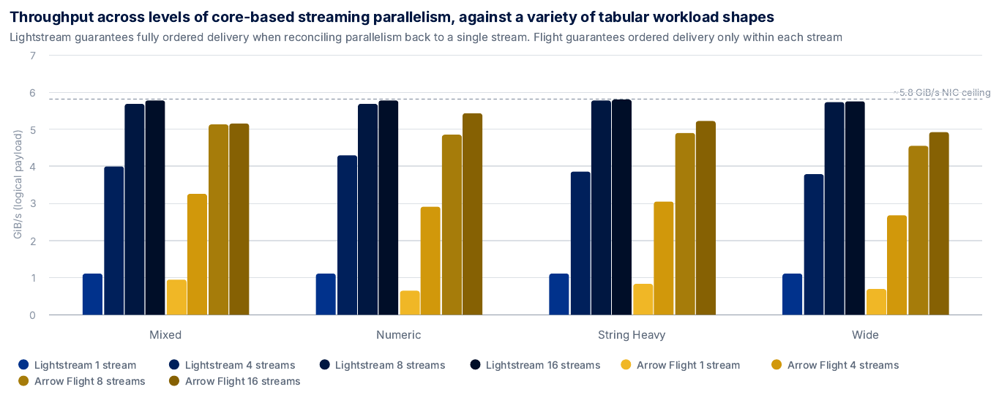
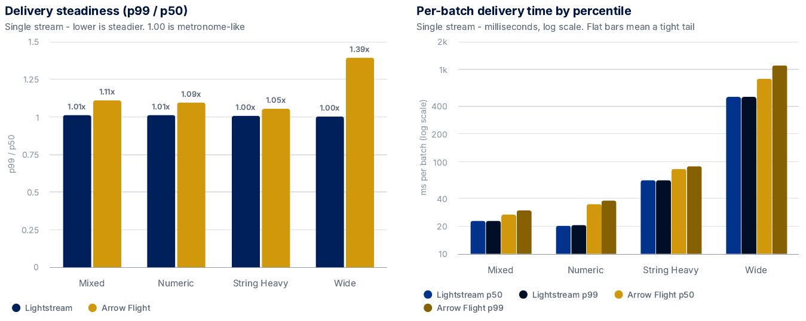
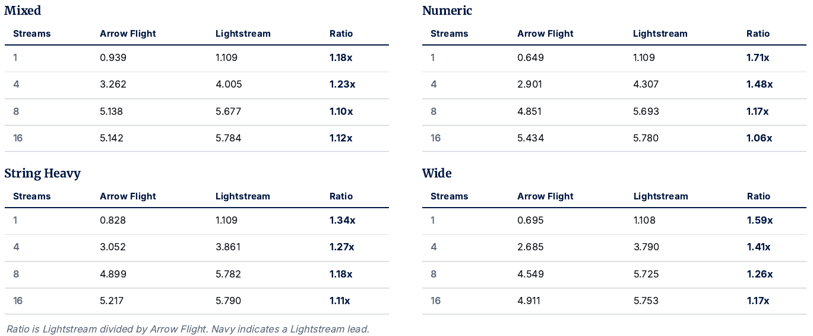

# Lightstream

High-throughput, composable table transport for Arrow-compatible data. Move tables between processes, services and storage without adopting gRPC or writing transport-specific framing.

## Installation

```bash
cargo install lightstream
```

## Quick start

**Receiver**

```rust
use futures_util::StreamExt;
use lightstream::models::readers::tcp::TcpTableReader;

let mut reader = TcpTableReader::connect("127.0.0.1:9000").await?;

while let Some(result) = reader.next().await {
    let table = result?;
    process(table);
}
```

**Sender**

```rust
use lightstream::models::writers::tcp::TcpTableWriter;

let mut writer = TcpTableWriter::connect("127.0.0.1:9000", schema, None).await?;
writer.write_table(batch_1).await?;
writer.finish().await?;
```

Other transports (HTTP/2, QUIC, WebSocket, UDS, files, memory maps) expose the same table-oriented interface.

## Why

- **One model, many transports.** Identical table APIs across TCP, HTTP/2, QUIC, WebSocket, Unix sockets, files, memory maps and chunked datasets.
- **Fast paths preserved.** Minarrow's 64-byte-aligned buffers flow through supported transports zero-copy.
- **Composable layers.** Encoding, framing, buffering and transport remain independent — use complete readers/writers or assemble lower-level codecs directly.
- **Practical optionality.** TLS, compression (zstd/snappy), decode limits for untrusted input, Linux `io_uring`, minimal dependencies.

## Capabilities

**Transports:** TCP, Unix domain sockets, HTTP/2, QUIC, WebSocket, WebTransport, standard I/O, `io_uring`.

**Formats:** Arrow IPC (file and stream), CSV, JSON, NDJSON, Parquet, TLV framing, memory maps, chunked datasets.

**Protocol:** Lightstream message multiplexing for Arrow tables, Protobuf and MessagePack over one connection.

**Advanced:** Parallel streams across TCP/QUIC/HTTP/2 with optional global ordering, compression, TLS, configurable decode safety.

## Performance

**Localhost¹**:

| Workload | Throughput |
|----------|------------|
| TCP streaming (parallel) | ~8.0 GiB/s |
| TCP streaming (serial) | ~5.0 GiB/s |
| UDS with `io_uring` | ~5.5 GiB/s |
| Arrow IPC file read | ~9 GiB/s |
| Memory-mapped Arrow IPC (warm) | ~170 GiB/s |

▎¹ = Intel Core Ultra 7 155H · 32 GB · Ubuntu 24.04 · Samsung SSD M2 EVO 990 PRO 2TB · 1.97-nightly release build.

**Cross-Host**
Lightstream performed faster than the industry standard alternative in every measured comparison, on open AWS EC2 benchmarks (see `benchmarks/`). This is despite returning a single globally ordered stream after parallelising connections for delivery, which is not offered natively within the other measured framework, and wearing that cost in the reported figures.



Its p99 was within 1% of p50 - consistent, low-jitter performance.



The full (warm-median of 5 runs) throughput numbers, across every workload shape and measured level of stream parallelism, are included below for reference.



<details>
<summary><sub><b>Methodology</b></sub></summary>

<sub>

Both systems serve the same RAM-resident Apache Arrow table, so the measured path is transport and network delivery only. The open benchmark is in this repository.

- **Identical hardware** - two AWS i3en.12xlarge instances, one placement group, and 50 Gbit/s network.
- **Median of five** - every cell is the warm median of five runs, smoothing transient cloud variance.
- **Arrow Flight configuration** - the official arrow-flight crate over gRPC/HTTP/2, Arrow-RS defaults, string data not re-materialised, with multiple connections to avoid multiplex throttling.
- **Receiver-verified** - throughput is logical payload in GiB/s, timed from request to final verified arrival.
- **Four schema shapes** - numeric, mixed, string-heavy and wide. One million rows per batch, from a 300 GB pool (before transport batch framing).
- **Ordered reconstruction** - Lightstream reconstructs one globally ordered stream across all connections, which counts against its own throughput (it wears the cost in the results). Arrow Flight orders only within each endpoint and leaves parallel streams separate. Both therefore provide their strongest ordering guarantees and stream configurations present without stepping outside of the framework boundaries.

</sub>

</details>

## Common patterns

**Compression**

Compress tables before sending or writing to disk.

```rust
use lightstream::compression::Compression;

let writer = TcpTableWriter::connect(
    address,
    schema,
    Some(Compression::Zstd),
).await?;
```

**Memory-mapped Arrow IPC**

The mmap reader is very fast. Warm mmap rivals standalone RAM speed, as it gets out the way.
Try the benchmark.

```rust
use lightstream::models::readers::ipc::mmap_table::MmapTableReader;

let reader = MmapTableReader::open("data.arrow")?;
for i in 0..reader.num_batches() {
    let table = reader.read_batch(i)?;
    process(table);
}
```

**Lightstream protocol** (multiplex protobuf messages and arrow tables)

```rust
use lightstream::models::protocol::connection::TcpLightstreamConnection;
use lightstream::models::protocol::LightstreamMessage;

let mut conn = TcpLightstreamConnection::from_tcp(stream);
conn.register_message("event");
conn.register_table("metrics", schema);

conn.send("event", b"user-login").await?;
conn.send_table("metrics", &table).await?;

while let Some(msg) = conn.recv().await {
    match msg? {
        // Protobuf message
        LightstreamMessage::Message { tag, payload } => { /* … */ }
        // Arrow table
        LightstreamMessage::Table { table, .. } => { /* … */ }
    }
}
```

## Parallel streams

TCP, QUIC and HTTP/2 readers and writers distribute tables across multiple connections, aggregating throughput beyond single-flow limits. Readers can restore global send order or return items in arrival order. 

The Lightstream protocol automatically provides total ordering across fanned out parallel streams. See the benchmarks for an example.

## TLS

Enable the `tls` feature for TCP, WebSocket and HTTP/2. QUIC and WebTransport include TLS at the protocol level.

```rust
let writer = TcpTableWriter::connect_tls(
    "api.example.com:9443",
    server_name,
    config,
    schema,
    None,
).await?;
```

## Examples

```bash
cargo run --example tcp_arrow --features tcp
cargo run --example websocket_arrow --features websocket
cargo run --example http_arrow --features http
cargo run --example quic_arrow --features quic
cargo run --example uds_arrow --features uds
```

## Feature flags

| Feature | Description |
|---------|-------------|
| `tcp` | TCP transport |
| `http` | HTTP/2 transport |
| `quic` | QUIC transport |
| `websocket` | WebSocket transport |
| `uds` | Unix domain sockets |
| `stdio` | Standard I/O |
| `webtransport` | WebTransport (experimental) |
| `mmap` | Memory-mapped Arrow IPC |
| `csv`, `json`, `parquet` | File format support |
| `zstd`, `snappy` | Compression |
| `protocol` | Lightstream message multiplexing |
| `msgpack`, `protobuf` | Message encodings (enables `protocol`) |
| `tls` | TLS for TCP, WebSocket, HTTP/2 |
| `io_uring` | Linux async I/O (experimental) |
| `datetime`, `large_string`, `extended_numeric_types` | Schema extensions |

## Buffering and safety

Streaming decoders use a per-stream arena reserving 2 GiB of virtual address space (configurable via `LIGHTSTREAM_ARENA_CAPACITY`). Physical memory is committed only as data arrives. Decode paths validate all input and enforce configurable limits on frame size, schema dimensions, strings, allocations and decompressed data.

## Architecture

| Layer | Components |
|-------|------------|
| Table API | Transport, parallel and chunked readers and writers |
| Protocol | Lightstream message multiplexing |
| Formats | Arrow IPC, CSV, JSON, Parquet, TLV |
| Framing | IPC messages, TLV frames, WebSocket frames |
| Encoding | One-shot codecs, stream encoders and decoders |
| Buffering | `Vec<u8>`, Minarrow `Vec64<u8>` and stream arenas |
| Transport | TCP, UDS, stdio, WebSocket, HTTP/2, QUIC, WebTransport, `io_uring` |
| Storage | Files, memory maps, chunked directories, async disk |

Applications can use complete readers and writers or assemble lower-level components directly.

## Licence

Mozilla Public License 2.0. © 2025–2026 Peter Garfield Bower.

Maintained by [SpaceCell](https://spacecell.com).